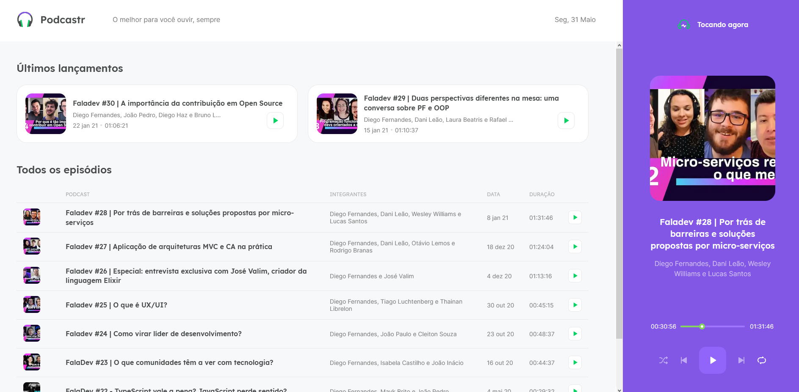

# nlw-05-podcastr

uma página reprodutora de podcasts desenvolvida com NextJS e ReactJS na Next Level Week 5, na trilha React, da Rocketseat.

a Next Level Week é um tipo de bootcamp, que dura uma semana, cujo objetivo é desenvolver, na prática, alguma aplicação ou projeto.

com o auxílio das vídeo aulas, desenvolvi junto com o instrutor a aplicação Podcastr.

# imagem da home

